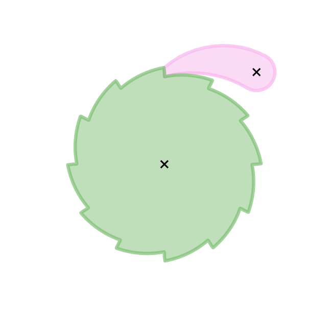

# eslint-seatbelt

Enable ESLint rules and prevent new errors today with a 2-file PR, then gradually fix the existing errors over time.

eslint-seatbelt is designed to work like a seatbelt [ratchet](https://en.wikipedia.org/wiki/Ratchet_%28device%29): it starts loose, but can only get tighter.




## Why eslint-seatbelt?

eslint-seatbelt is an open-source re-implementation of a Notion internal tool written by the same author in 2022. It was originally implemented to manage a multi-year migration to React function components, and has since proven invaluable in maintaining our large, fast-moving codebase with hundreds of active contributors. [Read more on the Notion blog](https://www.notion.com/blog/how-we-evolved-our-code-notions-ratcheting-system-using-custom-eslint-rules).

eslint-seatbelt improves on publicly available bulk suppression tools in a few ways:

Most other tools store error information in hierarchical formats like JSON or YAML that make merge conflicts confusing and painful. eslint-seatbelt stores errors in a simple `.tsv` tab-separated values file which minimizes (but doesn't totally eliminate) merge pain.

Other tools require complicated workflows invasive wrapper scripts, some going so far as to [monkey-patching in a replacement linter implementation](https://developers.tiktok.com/blog/bulk-suppressions-a-new-eslint-feature-for-large-codebases). eslint-seatbelt is a regular ESLint plugin ([using the processor API](https://eslint.org/docs/latest/extend/custom-processors)) so it integrates effortlessly with your editor, pre-commit hooks, and CI. It "tightens the seatbelt" by automatically reducing the allowed errors per file whenever you run `eslint` during development. In CI, state is frozen and checked for consistency with the current file error counts, so no one can forget to tighten the seatbelt.

## Setup

- ESLint >=8: `npm add --save-dev eslint-seatbelt`
- ESLint <=7: `npm add --save-dev eslint-plugin-eslint-seatbelt@npm:eslint-seatbelt` (note this aliases the package as `eslint-plugin-eslint-seatbelt` which is required by ESLint <=7)

### ESLint 8+ flat config

```js
// eslint.config.mjs
import seatbelt from 'eslint-seatbelt'

export default [
  // Add near the top of your config object array
  seatbelt.configs.enable,
  // ... other configs
]

// Equivalent to:
export default [
  {
    plugins: { 'eslint-seatbelt': seatbelt },
    rules: { 'eslint-seatbelt/configure': 'error' },
    processor: seatbelt.processors.seatbelt,
  }
  // ... other configs
]
```

### Legacy eslintrc config

```js
// .eslintrc.cjs
module.exports = {
  plugins: ["eslint-seatbelt"],
  extends: ["plugin:eslint-seatbelt/enable-legacy"]
}

// Equivalent to:
module.exports = {
  plugins: ["eslint-seatbelt"],
  rules: { "eslint-seatbelt/configure": "error" },
  processor: "eslint-seatbelt/seatbelt",
}
```

## Workflow

### Introducing a new rule

1. Add the rule to your ESLint config in "error" mode. (with eslint-seatbelt, configuring rules in "warning" mode is pointless)

    ```diff
    --- a/eslint.config.mjs
    +++ b/eslint.config.mjs
    @@ -18,6 +18,7 @@ export default tseslint.config(
       seatbelt.configs.enable,
       {
         rules: {
    +      "@typescript-eslint/ban-ts-comment": "error",
    ```

2. Run `SEATBELT_INCREASE=<rule> eslint` to increase allowed errors.
3. Commit the changes to your ESLint config (`eslint.config.mjs`) and seatbelt file (`eslint.seatbelt.tsv`)

### After fixing errors

1. `eslint`

### Verify seatbelt file is up-to-date

1. `SEATBELT_FROZEN=1 eslint` or `CI=1 eslint`

### Introduce ESLint to an existing codebase

eslint-seatbelt makes it easy to introduce ESLint to an existing unlinted codebase.

1. Install eslint, eslint-seatbelt, and your favorite ESLint plugins.
1. Configure plugins, rules, and set up eslint-seatbelt [as described above](#setup).
1. Run `SEATBELT_INCREASE=ALL eslint --fix` to either fix or allow existing errors.
1. Commit changes.

## Configuration

By default eslint-seatbelt stores error counts in a file named `eslint.seatbelt.tsv` in the current working directory. No configuration is required beyond setting up the plugin as described above. 

If you prefer to customize this location or other options, you can pass configuration to eslint-seatbelt by one of the following methods:

1. Defined in the shared `settings` object in your ESLint config. This
   requires also configuring the `eslint-seatbelt/configure` rule.

    ```js
    // in eslint.config.js
    const config = [
      {
        settings: {
          seatbelt: {
            // ...
          }
        },
        rules: {
          "eslint-seatbelt/configure": "error",
        }
      }
    ]
    ```

2. Using the `eslint-seatbelt/configure` rule in your ESLint config.
   This can be used to override settings for specific files in legacy ESLint configs.
   Any configuration provided here will override the shared `settings` object.

    ```js
    // in .eslintrc.js
    module.exports = {
      rules: {
        "eslint-seatbelt/configure": "error",
      },
      overrides: [
        {
          files: ["some/path/*"],
          rules: {
            "eslint-seatbelt/configure": ["error", { seatbeltFile: "some/path/eslint.seatbelt.tsv" }]
          },
        },
      ],
    }
    ```

3. The settings in config files can be overridden with environment variables when running `eslint` or other tools.

   ```bash
   SEATBELT_FILE=some/path/eslint.seatbelt.tsv SEATBELT_FROZEN=1 eslint
   ```

### Config reference

Copied from [./src/SeatbeltConfig.ts](./src/SeatbeltConfig.ts)

```typescript
export interface SeatbeltConfig {
  /**
   * The seatbelt file stores the max error counts allowed for each file. Should
   * be an absolute path.
   *
   * If not provided, $SEATBELT_PWD/eslint.seatbelt.tsv or $PWD/eslint.seatbelt.tsv will be used.
   *
   * ```js
   * // in eslint.config.js
   * const config = [
   *   {
   *     settings: {
   *       seatbelt: {
   *         // commonjs
   *         seatbeltFile: `${__dirname}/eslint.seatbelt.tsv`
   *         // esm
   *         seatbeltFile: new URL('./eslint.seatbelt.tsv', import.meta.url).pathname
   *       }
   *     }
   *   }
   * ]
   * ```
   *
   * You can also set this with environment variable `SEATBELT_FILE`:
   *
   * ```bash
   * SEATBELT_FILE=.config/custom-seatbelt-file eslint
   * ```
   */
  seatbeltFile?: string
  /**
   * By default whenever a file is linted and a rule has no errors, that rule's
   * max errors for the file is set to zero.
   *
   * However with typescript-eslint, it can be helpful to have two ESLint configs:
   *
   * - A default ESLint config with only syntactic rules enabled that don't
   *   require typechecking, that runs on developer machines and in their editor.
   * - A CI-only ESLint config with only type-aware rules enabled that requires
   *   typechecking. Since these rules require typechecking, they can be too
   *   slow to run in interactive contexts.
   *
   * To avoid seatbelt from mistakenly removing
   *
   * To avoid this, set `keepRules` to the names of *disabled but known rules*
   * while linting.
   *
   * Example:
   *
   * ```js
   * // Default ESLint config
   * module.exports = [
   *   {
   *     settings: {
   *       seatbelt: {
   *         keepRules: require('./eslint-typed.config.js').flatMap(config => Object.keys(config.rules ?? {})),
   *       }
   *     },
   *     rules: {
   *       "no-unused-vars": "error",
   *     },
   *   }
   * ]
   *
   * // Typechecking-required ESLint config for CI
   * module.exports = [
   *   {
   *     settings: {
   *       seatbelt: {
   *         keepRules: require('./eslint.config.js').flatMap(config => Object.keys(config.rules ?? {})),
   *       }
   *     },
   *     rules: {
   *       // Requires typechecking (slow)
   *       "@typescript-eslint/no-floating-promises": "error",
   *     },
   *   }
   * ]
   * ```
   *
   * You can also set this with environment variable `SEATBELT_KEEP`:
   *
   * ```bash
   * SEATBELT_KEEP="@typescript-eslint/no-floating-promises @typescript-eslint/prefer-reduce-type-parameter" \
   *   eslint
   * ```
   *
   * You can set this to `"ALL"` to enable this setting for ALL rules:
   *
   * ```bash
   * SEATBELT_KEEP=ALL eslint
   * ```
   */
  keepRules?: RuleId[] | "all"
  /**
   * When you enable a rule for the first time, lint with it in this set to set
   * the initial max error counts.
   *
   * Typically this should be enabled for one lint run only via an environment
   * variable, but it can also be configured via ESLint settings.
   *
   * ```bash
   * SEATBELT_INCREASE="@typescript-eslint/no-floating-promises" eslint
   * ```
   *
   * You can set this to `"ALL"` to enable this setting for ALL rules:
   *
   * ```bash
   * SEATBELT_INCREASE=ALL eslint
   * ```
   *
   * ```js
   * // in eslint.config.js
   * // maybe you have a use-case for this
   * const config = [
   *   {
   *     settings: {
   *       seatbelt: {
   *         allowIncreaseRules: ["@typescript-eslint/no-floating-promises"],
   *       }
   *     }
   *   }
   * ]
   * ```
   */
  allowIncreaseRules?: RuleId[] | "all"
  /**
   * Error if there is any change in the number of errors in the seatbelt file.
   * This is useful in CI to ensures that developers keep the seatbelt file up-to-date as they fix errors.
   *
   * It is enabled by default when environment variable `CI` is set.
   *
   * ```bash
   * CI=1 eslint
   * ```
   *
   * This can be set with the `SEATBELT_FROZEN` environment variable.
   *
   * ```bash
   * SEATBELT_FROZEN=1 eslint
   * ```
   *
   * Or in ESLint config:
   *
   * ```js
   * // in eslint.config.js
   * const config = [
   *   {
   *     settings: {
   *       seatbelt: {
   *         frozen: true,
   *       }
   *     }
   *   }
   * ]
   */
  frozen?: boolean
  /**
   * Completely disable seatbelt error processing for a lint run while leaving it otherwise configured.
   *
   * This can be set with the `SEATBELT_DISABLE` environment variable.
   *
   * ```bash
   * SEATBELT_DISABLE=1 eslint
   * ```
   *
   * Or in ESLint config:
   *
   * ```js
   * // in eslint.config.js
   * const config = [
   *   {
   *     settings: {
   *       seatbelt: {
   *         disable: true,
   *       }
   *     }
   *   }
   * ]
   */
  disable?: boolean
  /**
   * By default seatbelt assumes that only one ESLint process will read and
   * write to the seatbelt file at a time.
   *
   * This should be set to `true` if you use a parallel ESLint runner similar to
   * jest-runner-eslint to avoid losing updates during parallel writes to the
   * seatbelt file.
   *
   * When enabled, seatbelt creates temporary lock files to serialize updates to
   * the seatbelt file. This comes at a small performance cost.
   *
   * This is enabled by default when run with Jest (environment variable `JEST_WORKER_ID` is set).
   *
   * It can also be set with environment variable `SEATBELT_THREADSAFE`:
   *
   * ```bash
   * SEATBELT_THREADSAFE=1 eslint-parallel
   * ```
   *
   * Or in ESLint config:
   *
   * ```js
   * // in eslint.config.js
   * const config = [
   *   {
   *     settings: {
   *       seatbelt: {
   *         threadsafe: true,
   *       }
   *     }
   *   }
   * ]
   * ```
   */
  threadsafe?: boolean

  /**
   * Enable verbose logging.
   *
   * This can be set with the `SEATBELT_VERBOSE` environment variable.
   *
   * ```bash
   * SEATBELT_VERBOSE=1 eslint
   * ```
   *
   * Or in ESLint config:
   *
   * ```js
   * // in eslint.config.js
   * const config = [
   *   {
   *     settings: {
   *       seatbelt: {
   *         verbose: true,
   *       }
   *     }
   *   }
   * ]
   * ```
   *
   * If set to a function (like `console.error`), that function will be called with the log messages.
   * The default logger when set to `true` is `console.error`.
   */
  verbose?: boolean | "stdout" | "stderr" | ((...message: unknown[]) => void)
}
```

## Contributing

This project uses `pnpm` for package management.

### Improvement ideas

- [ ] Finish SEATBELT_THREADSAFE implementation
- [ ] Set SEATBELT_DISABLE=1 during git merge/rebase events
- [ ] Add SEATBELT_DISABLE_IN_EDITOR config option
- [ ] Integration tests
- [ ] Git merge driver to automatically resolve eslint.seatbelt.tsv conflicts

## Thanks & Acknowledgements

- Dedicated to [Nora Tarano](https://github.com/noratarano), who inspired me to write the open-source version. I love you.
- Thank you to [Ben Kraft](https://github.com/benjaminjkraft) for improvements to the Notion internal version, and for discussing changes for the open-source version.
- Thank you to Notion Labs, Inc for supporting engineering excellence. If you like this sort of thing, consider [joining us](https://www.notion.com/careers)!
- `Ratchet_Gear_and_Pawl.gif` by Arglin Kampling - Own work, CC BY-SA 4.0, https://commons.wikimedia.org/w/index.php?curid=123530838
